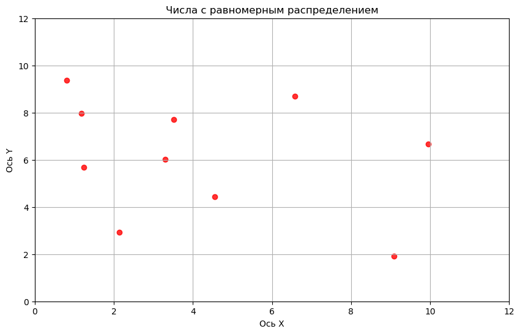
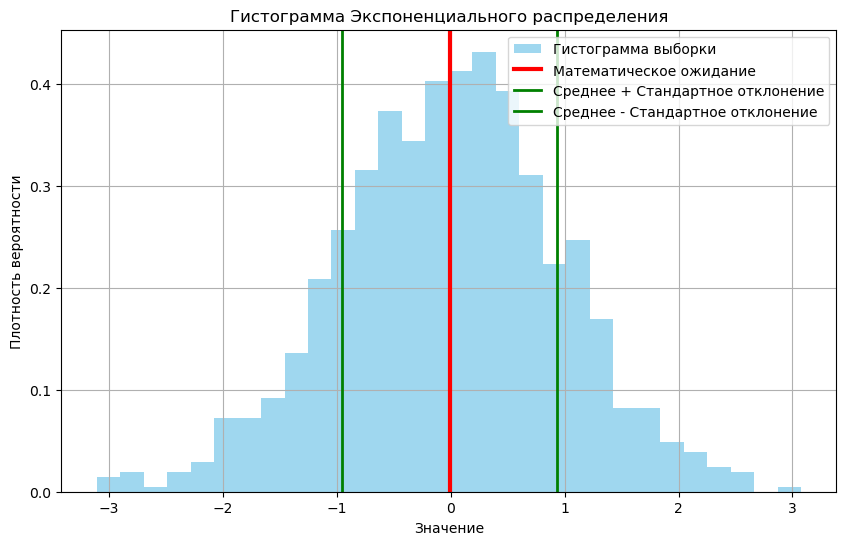
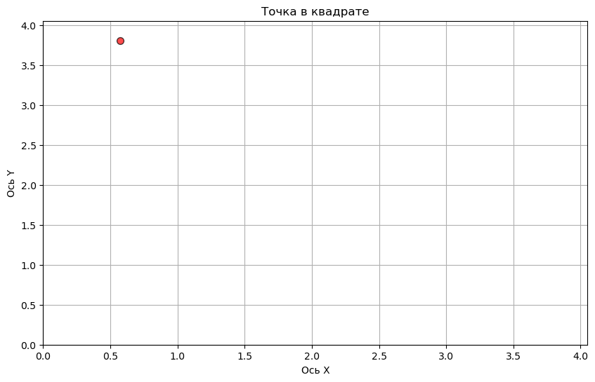

# Лабораторная работа №1

## Цели
1. Ознакомление со средой имитационного моделирования на языке программирования
Python (или любой другой язык по желанию студента).
2. Изучение основных типов данных, команды ввода и вывода данных, статистические
методы работы с данными.


```python
import numpy as np
import matplotlib.pyplot as plt
```


```python
# jupyter nbconvert --to markdown code_lab1.ipynb
```

# Задание №1

**Построить матрицу c количеством строк 10 и столбцов 2, переменные заполняются случайными числами с равномерным распределением. Полученные сгенерированные случайные числа представить на графике в виде точек.**


```python
m = 10 
n = 2 
mu = 0    
sigma = 10 
matrix = np.random.uniform(mu, sigma, (m, n)) #.astype(int)

print(matrix)
```

    [[6.57905948 8.70401537]
     [1.2412029  5.69342378]
     [2.13075325 2.92300646]
     [3.30407464 6.02805478]
     [0.79709955 9.3760902 ]
     [9.95455063 6.66375084]
     [1.18385106 7.97629216]
     [4.54987786 4.43184522]
     [9.09629108 1.91032032]
     [3.52083637 7.70159423]]
    

### График распределения чисел


```python
plt.figure(figsize=(10, 6))
plt.scatter(matrix[:, 0], matrix[:, 1], alpha=0.8, color="red", label="Точки матрицы")
plt.xlim(0,12)
plt.ylim(0,12)
plt.xlabel("Ось X")
plt.ylabel("Ось Y")
plt.title("Числа с равномерным распределением")
plt.grid(True)
plt.show()
```


    

    


# Задание №2

**Сгенерировать 1000 случайных чисел с любым известным распределением и построить их гистограмму, математическое ожидание, дисперсию.**

### Экспонециальное распределение 


```python
exp_sample_1000 = np.random.normal(scale=1, size=1000)
E = sum(exp_sample_1000)/len(exp_sample_1000)
Var = np.var(exp_sample_1000)
```

### Гистограмма нормального распределения


```python
plt.figure(figsize=(10, 6))
plt.hist(exp_sample_1000, bins=30, density=True, alpha=0.8, color="skyblue", label="Гистограмма выборки")
plt.axvline(E, color='r', linewidth=3, label='Математическое ожидание')
plt.axvline(E + Var, color='g', linewidth=2, label="Среднее + Стандартное отклонение")
plt.axvline(E - Var, color='g', linewidth=2, label="Среднее - Стандартное отклонение")
plt.title("Гистограмма Экспоненциального распределения")
plt.xlabel("Значение")
plt.ylabel("Плотность вероятности")
plt.legend()
plt.grid(True)
plt.show()
```


    

    


# Задание 3

**Сгенерировать случайную точку, равномерно распределенную в квадрате со стороной а.** 

### Построение квадрата и точки


```python
a = np.random.uniform(5)
def generate_point(a):
    x1 = np.random.uniform(0, a)
    y1 = np.random.uniform(0, a)
    return x1,y1
```

### Визуализация точки в квадрате


```python
x1,y1=generate_point(a)
plt.figure(figsize=(10, 6))
plt.scatter(x1,y1,s=50,color="red",alpha=0.7,edgecolors="black",linewidths=1)
plt.xlim(0,a)
plt.ylim(0,a)
plt.xlabel("Ось X")
plt.ylabel("Ось Y")
plt.title("Точка в квадрате")
plt.grid(True)
plt.show()
```


    

    


# Выводы

1.  В ходе работы произошло ознакомление со средой  программирования Python для генерации случайных (numpy) чисел и их визуализации(matplotlib). В процессе изучены основные функции для работы со случайными величинами и построения графиков.
   
2.  В рамках второго задания были сгенерированы 1000 случайных чисел с **нормальным** распределением, а также вычислено его математическое ожидание и дисперсия. 

3.  Графическое представление данных, таких как точки на плоскости и гистограмма распределения, позволило получить наглядное представление о случайных величинах и их распределении. 

4.  В третьем задании была сгенерирована случайная точка, равномерно распределённая в квадрате. В дальнейшем данная схема может быть усложнена и использована для моделирования реальных ситуаций нахождения объекта в пространстве.

5.  Работа с Python для имитационного моделирования позволила понять, как можно применять статистические и вероятностные методы для решения задач моделирования. 
